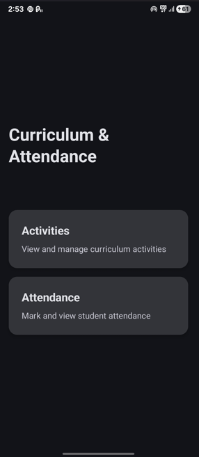
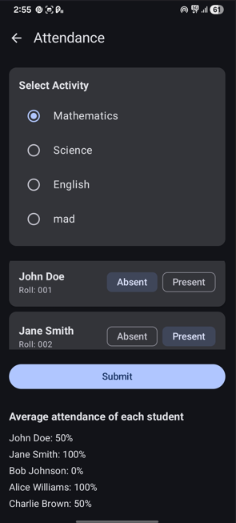

# Curriculum & Attendance App (Android – Jetpack Compose)

A simple Android app for managing curriculum activities and tracking student attendance. Built with **Kotlin**, **Jetpack Compose**, and **Material 3**.

---

## Features

### Home Screen
- Clean landing screen with navigation to:
  - **Activities** screen
  - **Attendance** screen

### Activities Management
- View a list of curriculum activities (e.g., Mathematics, Science, English).
- Each activity shows:
  - Title
  - Description
  - Date
- Add a new activity using a floating “Add” button:
  - Enter **title** and **description** in a dialog.
  - New activity automatically gets the current date.

### Attendance Tracking
- Select an activity using radio buttons at the top.
- See all students in a scrollable list.
- For each student:
  - View **name** and **roll number**.
  - Mark them **Present** or **Absent** using toggle chips.
- Attendance is stored **per activity per date**.
- **Submit button**:
  - Calculates and shows:
    - Total present students
    - Total students
    - Attendance percentage for the current session (e.g., `Present: 3 / 5 (Attendance: 60%)`).
- **Average attendance per student**:
  - For each student, shows their overall attendance average (percentage) across all recorded sessions and activities.

---

## Technology Stack

- **Language**: Kotlin
- **UI**: Jetpack Compose
- **Design**: Material 3 (`MaterialTheme`, `TopAppBar`, `Card`, `Button`, `FilterChip`, etc.)
- **Architecture**:
  - `AppViewModel` using **StateFlow** to expose:
    - `students`
    - `activities`
    - `attendance`
  - In-memory data (no database) with sample students and activities.
  - Navigation handled via **Navigation Compose** with a `NavHost`:
    - `Home`
    - `Activities`
    - `Attendance`

---

## Project Structure (Key Files)

- `MainActivity.kt` – Sets up Compose content, theme, `NavController`, and `AppViewModel`.
- `navigation/NavGraph.kt` – Defines navigation routes and composable screens.
- `ui/screens/HomeScreen.kt` – Home UI with navigation cards to Activities and Attendance.
- `ui/screens/ActivitiesScreen.kt` – List of activities and dialog to add new ones.
- `ui/screens/AttendanceScreen.kt` – Activity selection, student list, attendance marking, submit button, and per-student average.
- `viewmodel/AppViewModel.kt` – Holds sample students, activities, and attendance state.
- `data/Student.kt`, `data/Activity.kt`, `data/Attendance.kt` – Simple data classes for app models.

---

## How to Run

1. **Requirements**
  - Android Studio (Giraffe/Flamingo or newer recommended).
  - Android SDK configured.

2. **Steps**
  - Open Android Studio.
  - Click **Open** and select this project folder.
  - Let Gradle sync finish.
  - Select an emulator or physical device.
  - Press **Run**.

---

## How It Works (High-Level)

- The `AppViewModel` initializes with sample students and activities.
- Screens collect state from the view model using `collectAsState()`.
- Attendance is recorded by calling `markAttendance(activityId, studentId, isPresent)`.
- The **Submit** button on the attendance screen reads the current attendance for the selected activity and computes:
  - Session attendance percentage.
- A separate calculation runs over all attendance records to compute **average attendance per student**, which is then displayed under the Submit section.

---

## Possible Extensions

- Persist data using Room or DataStore so attendance is not lost on app restart.
- Add filters by date or activity category.
- Export attendance reports as CSV or PDF.
- Add authentication for teachers vs students.
